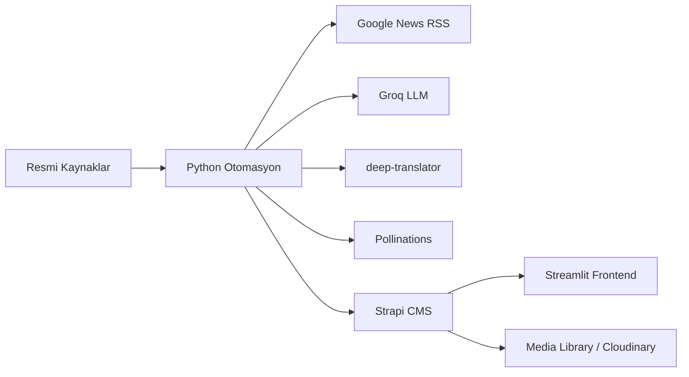

# BIP210 Final Proje Raporu

## 1. Kapak Sayfası

- Proje Adı:
- Ad Soyad:
- Öğrenci Numarası:
- Ders: BIP210 İçerik Yönetimi

## 2. Proje Özeti

Bu projede Strapi tabanlı içerik yönetimi, Python otomasyon akışı ve Streamlit arayüzü bir araya getirilerek çok dilli, YZ destekli bir gezi rehberi sistemi geliştirilmiştir.

## 3. Sistem Mimarisi Şeması

Şema açıklaması:
- Kaynak sitelerden temel içerik çekilir.
- Metin güncel haberlerle zenginleştirilir.
- İngilizce çeviri üretilir.
- Görsel üretilip Strapi Media Library'ye yüklenir.
- Son kullanıcıya Streamlit arayüzünde sunulur.

## 4. Erişim Bilgileri

- Strapi Admin URL:
- Değerlendirme Kullanıcısı:
- Değerlendirme Şifresi:
- Streamlit URL:

## 5. Veri Modeli ve İlişkiler

### City

- `ad`
- `ulke`
- `kisa_bilgi`
- `locale`

### Place

- `mekan_adi`
- `aciklama`
- `puan`
- `kapak_resmi`
- `city`
- `locale`

### İlişki

- Bir `City` birden fazla `Place` kaydına sahiptir.
- Çok dillilik `TR` ve `EN` locale'leriyle aktiftir.

Bu bölüme Strapi ekran görüntülerini ekleyin.

## 6. Teknik Detaylar

### Otomasyon Akışı

- `sources.json` içindeki resmi kaynaklar okunur.
- Kaynaktan TR açıklama çekilir.
- Google News RSS ile haber başlıkları alınır.
- Groq ile açıklama zenginleştirilir.
- `deep-translator` ile EN açıklama üretilir.
- Pollinations ile görsel oluşturulur.
- Strapi REST API üzerinden içerik ve medya yüklenir.

### Ana Fonksiyonlar

- `load_sources()`: kaynak manifestini okur
- `extract_source_content()`: resmi sayfadan açıklama çıkarır
- `google_news_al()`: ilgili haber başlıklarını toplar
- `groq_ile_zenginlestir()`: metni geliştirir
- `metni_ingilizceye_cevir()`: EN çeviriyi üretir
- `upsert_document()`: Strapi'de create/update akışını yönetir

Bu bölüme `otomasyon.py` dosyasından ilgili kod parçalarını ve kısa açıklamaları ekleyin.

## 7. Sistem Kanıtları

Eklenecek ekran görüntüleri:

1. Otomasyon çalışmadan önce boş Strapi liste görünümü
2. Otomasyon terminal çıktısı
3. Otomasyon sonrası dolu Strapi liste görünümü
4. Media Library ekranı
5. Streamlit ana sayfası
6. TR ve EN görünüm karşılaştırması

## 8. Sonuç

Bu bölümde:
- sistemin uçtan uca çalıştığını,
- çok dilli yapının aktif olduğunu,
- YZ ve otomasyon entegrasyonunun başarıyla tamamlandığını
özetleyin.
