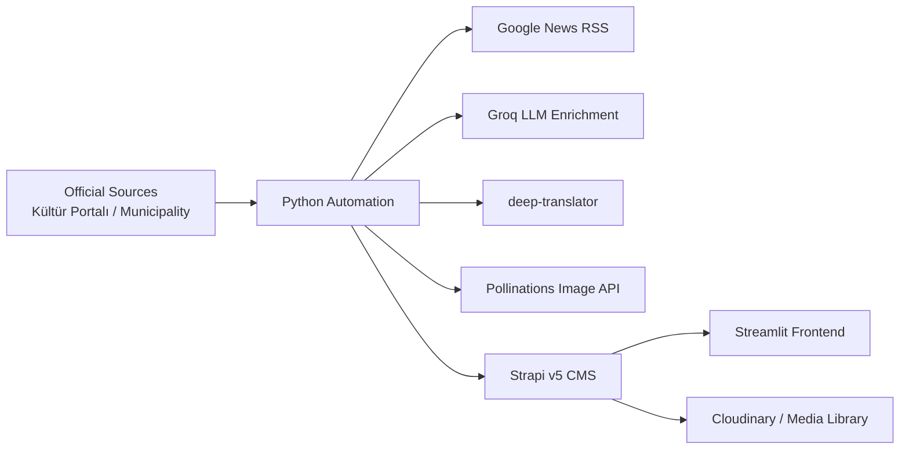

# BIP210 Final Projesi - YZ Destekli Gezi Rehberi

Bu repo, `Strapi + Python + Streamlit` kullanan çok dilli bir gezi rehberi teslimini içerir. Sistem resmi turizm kaynaklarından temel içerik toplar, metni YZ ile zenginleştirir, İngilizceye çevirir, görsel üretir ve sonuçları Strapi üzerinden Streamlit arayüzüne taşır.

## Mimari



## Klasörler

- `app.py`: Streamlit arayüzü
- `otomasyon.py`: veri toplama, çeviri, YZ zenginleştirme ve Strapi senkronizasyonu
- `sources.json`: resmi kaynak manifesti
- `gezi-rehberi-backend/`: Strapi v5 backend
- `FINAL_RAPOR_SABLONU.md`: final PDF raporu için doldurulabilir taslak

## Gereksinimler

- Python 3.11+
- Node.js 20+
- Strapi v5
- İsteğe bağlı: Cloudinary hesabı
- İsteğe bağlı: Groq API anahtarı

## Ortam Değişkenleri

### Otomasyon

Kök dizindeki `.env.example` dosyasını örnek al:

```bash
STRAPI_URL=http://localhost:1337
STRAPI_EMAIL=ingest@example.com
STRAPI_PASSWORD=change-me
GROQ_API_KEY=gsk_xxx
```

Not:
- Önerilen akış JWT girişidir: `STRAPI_EMAIL` + `STRAPI_PASSWORD`
- Gerekirse geriye dönük uyumluluk için `STRAPI_TOKEN` da desteklenir

### Streamlit

`.streamlit/secrets.toml.example` içeriğini `secrets.toml` olarak düzenleyip canlı Strapi bilgilerini gir:

```toml
STRAPI_URL = "https://your-strapi-service.onrender.com"
STRAPI_TOKEN = "read-only-token"
```

### Strapi Backend

`gezi-rehberi-backend/.env.example` içinde:

- `DATABASE_CLIENT`
- `DATABASE_URL` veya Postgres alanları
- `CLOUDINARY_NAME`
- `CLOUDINARY_KEY`
- `CLOUDINARY_SECRET`

## Kurulum

### 1. Python bağımlılıkları

```bash
pip install -r requirements.txt
```

### 2. Strapi backend

```bash
cd gezi-rehberi-backend
npm install
npm run develop
```

### 3. Streamlit frontend

```bash
streamlit run app.py
```

## Otomasyon Komutları

### Dry run

Strapi'ye yazmadan kaynak çekme, haber toplama, çeviri ve prompt üretimini doğrular:

```bash
python otomasyon.py --dry-run
```

### Sınırlı kaynak seti

```bash
python otomasyon.py --limit 3
```

### Tam senkronizasyon

```bash
python otomasyon.py
```

### İçeriği sıfırlayıp yeniden kurma

Bu komut önce yerel SQLite veritabanını yedekler, sonra Strapi içeriğini temizleyip yeniden yükler:

```bash
python otomasyon.py --reset-strapi
```

## Notlar

- GoTürkiye sayfaları bazı ortamlarda Cloudflare koruması nedeniyle sunucu taraflı `requests` erişimini engelleyebilir. Bu nedenle manifestte erişilebilir resmi sayfalar ağırlıklı olarak `Kültür Portalı` ve ilgili resmi belediye sayfalarıyla doldurulmuştur.
- Strapi içerikleri `status=published` ile yazılır; importer aynı dokümanı güncelleyerek tekrar çalıştırılabilir.
- Görsel yükleme için Cloudinary tanımlıysa kalıcı medya kullanılır, aksi halde Strapi local upload provider dev ortamında çalışır.

## Teslim İçin Kontrol Listesi

- Strapi admin URL hazır
- Değerlendirme hesabı hazır
- Streamlit URL hazır
- `python otomasyon.py --dry-run` başarılı
- `python otomasyon.py` ile içerik senkronize
- Ekran görüntüleri ve rapor dolduruldu
